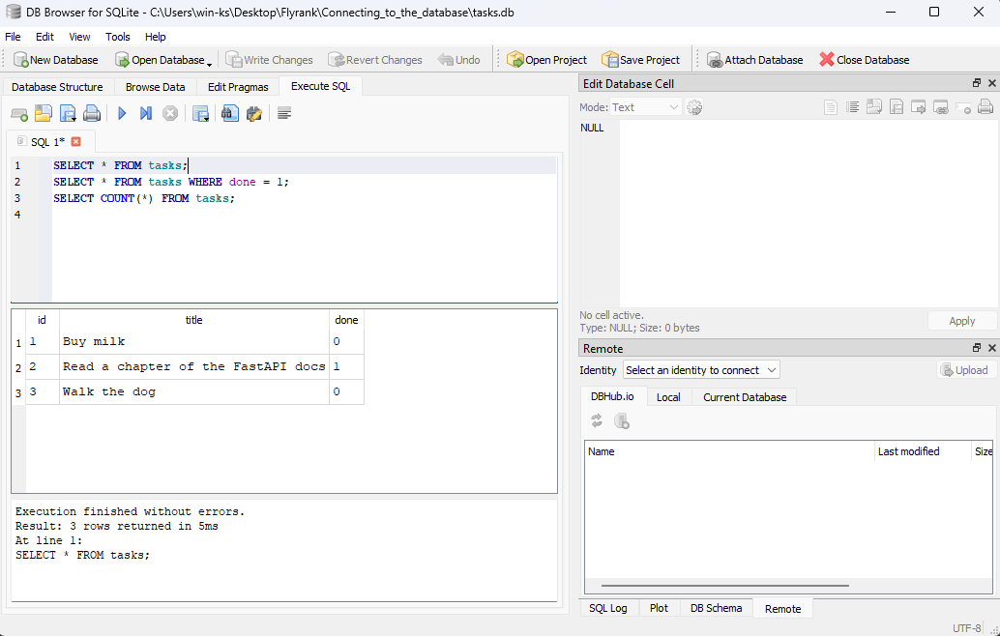

# Poking at `tasks.db` directly

The point of this stage was to prove the API is not the only door into the data.
Every statement below was run straight against `tasks.db` **while the server was
still running**, and then `GET /tasks` was called to see whether the API noticed.

It did — with no restart. That is the difference between a database and a list in
memory: the data lives in the file, and the app is just one of the things reading it.

## The session

```sql
sqlite> SELECT * FROM tasks;
         (1, 'Buy milk', 0)
         (2, 'Read a chapter of the FastAPI docs', 1)
         (3, 'Walk the dog', 0)

sqlite> SELECT * FROM tasks WHERE done = 1;
         (2, 'Read a chapter of the FastAPI docs', 1)

sqlite> SELECT COUNT(*) FROM tasks;
         (3,)

sqlite> UPDATE tasks SET done = 1;
         3 rows affected
```

`GET /tasks` right after that `UPDATE`, same server process, no restart:

```json
[{"id":1,"title":"Buy milk","done":true},
 {"id":2,"title":"Read a chapter of the FastAPI docs","done":true},
 {"id":3,"title":"Walk the dog","done":true}]
```

All three flipped to `done: true`, because `UPDATE` with no `WHERE` clause hits
every row. Then:

```sql
sqlite> DELETE FROM tasks WHERE done = 1;
         3 rows affected
```

`GET /tasks` after that:

```json
[]
```

```sql
sqlite> SELECT COUNT(*) FROM tasks;
         (0,)
```

## Two things worth writing down

**`UPDATE` and `DELETE` without a `WHERE` are not warned about.** `UPDATE tasks SET
done = 1;` reported "3 rows affected" as calmly as if it had been asked for one.
The `WHERE` clause is the only thing standing between a small edit and the whole
table, and SQL will not ask whether that was the intention.

**Emptying the table brings the example tasks back.** Startup seeds when the table
has zero rows, so after the `DELETE` above, the next restart inserted the three
example tasks again. That follows from the rule as specified — "seed only if the
table is empty" — and it is not the same thing as seeding on every restart: as
long as a single row survives, the seed never fires again.

## Screenshot

_Placeholder — to be replaced with a screenshot of `tasks.db` open in DB Browser
for SQLite._

<!--  -->
